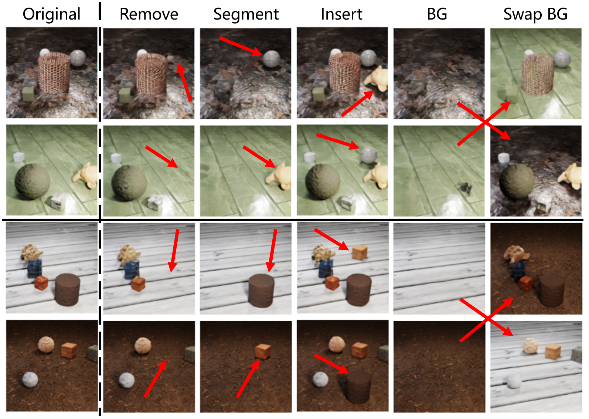

# SlotDiffusion

[**SlotDiffusion: Unsupervised Object-Centric Learning with Diffusion Models**](https://slotdiffusion.github.io/)<br/>
[Ziyi Wu](https://wuziyi616.github.io/),
Jingyu Hu,
Wuyue Lu,
[Igor Gilitschenski](https://tisl.cs.utoronto.ca/author/igor-gilitschenski/),
[Animesh Garg](https://animesh.garg.tech/)<br/>
_[arXiv'23]() |
[GitHub](https://github.com/Wuziyi616/SlotDiffusion) |
[arXiv]() |
[Project page](https://slotdiffusion.github.io/)_



## Introduction

This is the official PyTorch implementation for paper: [SlotDiffusion: Unsupervised Object-Centric Learning with Diffusion Models]().
The code contains:

-   SOTA unsupervised object-centric models, Slot Attention, SAVi, STEVE, and **SlotDiffusion**
-   Object segmentation, image/video reconstruction, compositional generation on 6 datasets
-   Video prediction and VQA on Physion dataset
-   Scale up to real-world datasets: PASCAL VOC and COCO

## Update

-   2023.5.14: Initial code release!

## Installation

Please refer to [install.md](docs/install.md) for step-by-step guidance on how to install the packages.

## Experiments

**This codebase is tailored to [Slurm](https://slurm.schedmd.com/documentation.html) GPU clusters with preemption mechanism.**
For the configs, we mainly use A40 with 40GB memory (though many experiments don't require so much memory).
Please modify the code accordingly if you are using other hardware settings:

-   Please go through `scripts/train.py` and change the fields marked by `TODO:`
-   Please read the config file for the model you want to train.
    We use DDP with multiple GPUs to accelerate training.
    You can use less GPUs to achieve a better memory-speed trade-off

### Dataset Preparation

Please refer to [data.md](docs/data.md) for dataset downloading and pre-processing.

### Reproduce Results

Please see [benchmark.md](docs/benchmark.md) for detailed instructions on how to reproduce our results in the paper.

## Citation

Please cite our paper if you find it useful in your research:

```

```

## Acknowledgement

We thank the authors of [Slot-Attention](https://github.com/google-research/google-research/tree/master/slot_attention), [slot_attention.pytorch](https://github.com/untitled-ai/slot_attention), [SAVi](https://github.com/google-research/slot-attention-video/), [SLATE](https://github.com/singhgautam/slate), [STEVE](https://github.com/singhgautam/steve), [DINOSAUR](https://github.com/amazon-science/object-centric-learning-framework), [MaskContrast](https://github.com/wvangansbeke/Unsupervised-Semantic-Segmentation) and [SlotFormer](https://github.com/Wuziyi616/SlotFormer) for opening source their wonderful works.

## License

SlotDiffusion is released under the MIT License. See the LICENSE file for more details.

## Contact

If you have any questions about the code, please contact Ziyi Wu dazitu616@gmail.com
